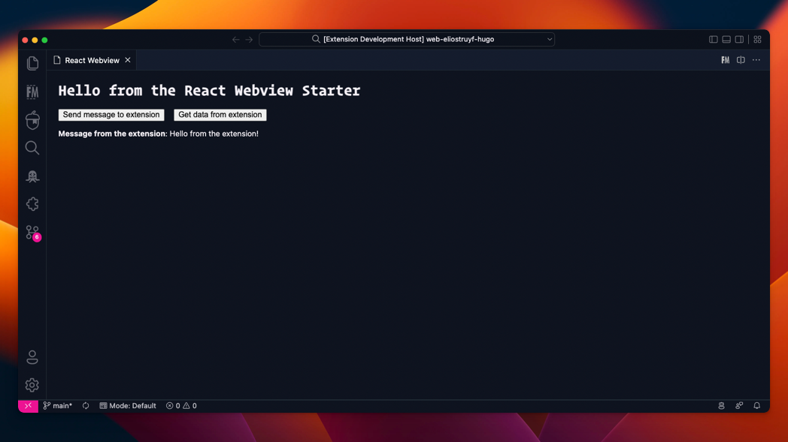

<<<<<<< HEAD
# Visual Studio Code Extension - React Webview Starter

This is a starter template for creating a Visual Studio Code extension with a React webview.

## Development

- Clone this repository
- Run `npm install` to install dependencies
- Run `npm run watch` to start developing

## Usage

The webview can be tested/opened by running the `React Webview: Open webview` command from the command palette.

=======
# vscode-SprintDesk
>>>>>>> cf8605bc8cd08c139bcc5b5bf0cb6ae653094f55
