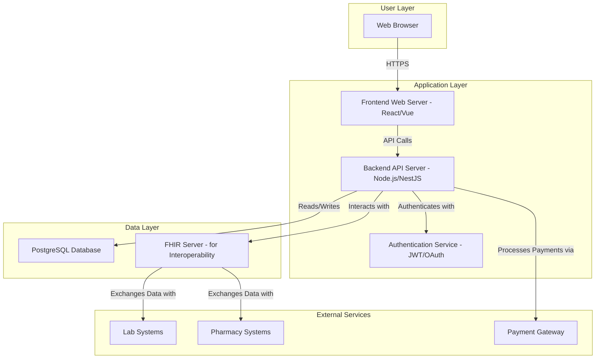

# High-Level Architecture Diagram

This diagram illustrates the high-level architecture of the EHR application. It follows a classic three-tier architecture pattern, which separates the user interface, application logic, and data storage into distinct layers.

## Component Descriptions

- **Web Browser:** The client application that users (doctors, nurses, receptionists) interact with.
- **Frontend Web Server:** Serves the single-page application (SPA) built with React or Vue.js.
- **Backend API Server:** The core of the application, handling business logic, data processing, and communication with the database and external services.
- **Authentication Service:** Manages user login and API security using JWT and OAuth 2.0.
- **PostgreSQL Database:** The primary data store for all patient, clinical, and billing information.
- **FHIR Server:** A dedicated server to handle data exchange with external healthcare systems using the FHIR standard. This promotes interoperability.
- **External Services:** Third-party systems that the EHR interacts with, such as labs for test results, pharmacies for e-prescribing, and payment gateways for billing.