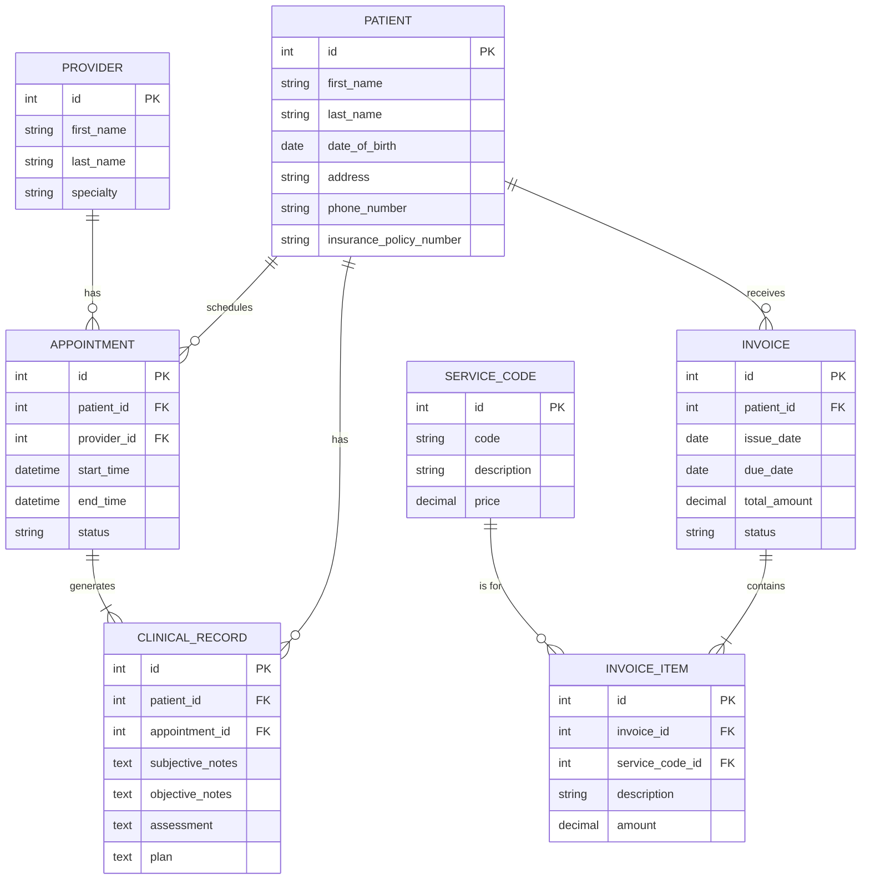

# Data Model for Patient Records and Billing

This document outlines the basic data model for the EHR system, focusing on the core entities for patient records and billing. This is a simplified model and would need to be expanded for a full implementation.

## Entity-Relationship Diagram (ERD)

## Table Descriptions

- **PATIENT:** Stores demographic and insurance information for each patient.
- **PROVIDER:** Stores information about the healthcare providers in the clinic.
- **APPOINTMENT:** Manages scheduled appointments for patients with providers.
- **CLINICAL_RECORD:** Contains the clinical notes (SOAP format) for each patient encounter.
- **INVOICE:** Represents a bill for services rendered to a patient.
- **INVOICE_ITEM:** A line item on an invoice, corresponding to a specific service provided.
- **SERVICE_CODE:** A list of standard medical service codes (e.g., CPT codes) and their prices.